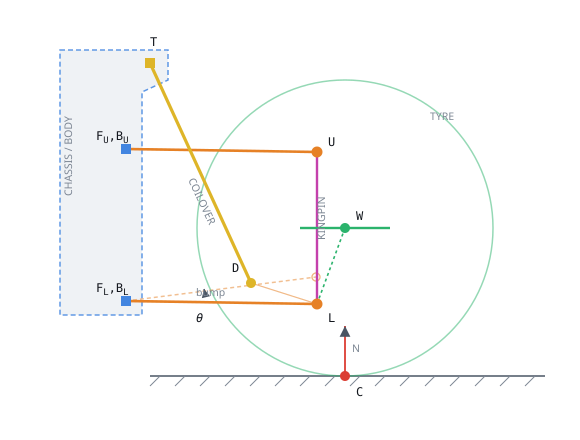

# The Double-Wishbone Corner

Every equation `UWishboneSuspension` actually solves, in the order it solves them,
with a symbol table so you never have to guess which angle belongs to which arm.

**This file is the reference the source comments point at.** Equation numbers here
(`W.1` … `W.50`) are the ones cited in the code as `// Doc (W.n)`, so a number in a
comment and a number on this page always mean the same thing. Keep them in step:
if you renumber here, grep the plugin for `Doc (W.` first.

Covers `WishboneGeometry.h`, `WishboneSuspension.h/.cpp`, `WishboneSuspensionDebug.cpp`
and the driving code in `Car.cpp`.

**Debug-draw colours.** The palette below is grouped by subsystem and matches the
in-engine draw exactly, since both are generated from the same RGB constants in
`WishboneSuspensionDebug.cpp`: chassis-fixed points blue, arms and ball joints
orange, the kingpin magenta, the coilover yellow, wheel and spindle green, the
contact patch red.

## §1 Nomenclature

**Conventions.** *Italic* is a scalar, **bold** is a 3-vector. A subscript *0* means the value at rest (θ = 0). An overdot is d/d*t*. Points are in the body's local frame, centimetres, unless a symbol is marked *world*.

The colour chips match the in-engine debug draw, so a symbol here is the same colour as the thing it names on screen.

**Points — chassis-fixed (drawn as squares)**

| Symbol | Code | Meaning | Units |
|---|---|---|---|
| **F**_L | `LCA_F_Rest` | Lower arm, front chassis bush | cm |
| **B**_L | `LCA_B_Rest` | Lower arm, rear chassis bush | cm |
| **F**_U | `UCA_F_Rest` | Upper arm, front chassis bush | cm |
| **B**_U | `UCA_B_Rest` | Upper arm, rear chassis bush | cm |
| **T** | `CoiloverTop_Rest` | Coilover top mount | cm |

**Points — moving with θ (drawn as circles)**

| Symbol | Code | Meaning | Units |
|---|---|---|---|
| **L**(θ) | `LowerBallJointAtAngle` | Lower ball joint. Rigid to the lower arm | cm |
| **U**(θ) | `UpperBallJointAtAngle` | Upper ball joint. Rigid to the upper arm | cm |
| **D**(θ) | `DamperMountCS` | Damper mount. Rigid to the *lower arm* | cm |
| **W**(θ) | `WheelCentreAtAngle` | Wheel centre. Rigid to the *knuckle*, not the arm | cm |
| **C**(θ) | `ContactPointWS` | Contact patch *(world)* | cm |

> GroundPointWS (the once-per-frame raycast hit) still drives the contact math below, but has no marker of its own in the debug draw — it added a second, unexplained dot next to **C** with no benefit for tuning the corner.

**Angles — the ones that get confused**

| Symbol | Code | Meaning | Units |
|---|---|---|---|
| *θ* | `ThetaRad` / `ArticulationAngleDeg` | **Lower arm** articulation angle. The one and only degree of freedom — the whole state of the corner is θ and θ̇ | rad  /  deg |
| *θ̇* | `ThetaDotRad` | **Lower arm** angular velocity | rad/s |
| *θ̈* | `ThetaAccel` | **Lower arm** angular acceleration | rad/s² |
| *φ*(θ) | `UpperArmSolvedAngleAtAngle` | **Upper arm** angle. *Solved* from θ by the rigid-knuckle constraint — never an independent variable, and equal to θ only for equal-length parallel arms | deg |
| *δ* | `SteerAngleDeg` | Steer angle, about the *live* kingpin | deg |
| *γ* | `LiveCamberDeg` | Camber. Positive = top leans outboard | deg |

> [!NOTE]
> **The one that trips everyone**
>
> There is **no wheel-spin variable anywhere in this model**. Rolling, slip and drive torque belong to `UPacejkaTyreComponent` and its `FShaft`. A wishbone corner only ever knows θ — how far the lower arm has swung. If you are looking for ω, it is in the other system.

**Directions — all unit vectors**

| Symbol | Code | Meaning | Units |
|---|---|---|---|
| **n**_L | `LCA_HingeAxis` | Lower hinge axis, **F**_L→**B**_L | – |
| **n**_U | `UCA_HingeAxis` | Upper hinge axis, **F**_U→**B**_U | – |
| **k**(θ) | `KingpinLive` | Kingpin / steering axis, **L**→**U** | – |
| **e**_c | `CoiloverDir` | Coilover axis, **T**→**D** *(world)* | – |
| **n**_g | `GroundNormalWS` | Ground normal *(world)* | – |
| **s** | `SpindleAxis_Rest` | Spindle (axle) direction, outboard | – |

**Tangents — the objects that make the whole method work**

| Symbol | Code | Meaning | Units |
|---|---|---|---|
| **t**_W | `WheelTangent` | ∂**W**/∂θ. Direction = where the wheel centre is instantaneously heading; magnitude = its moment arm about the hinge | m/rad |
| **t**_D | `DamperTangent` | ∂**D**/∂θ. Same, for the damper mount | m/rad |

**Scalars, parameters and forces**

| Symbol | Code | Meaning | Units |
|---|---|---|---|
| Rigid lengths |  |  |  |
| *ℓ*_kp | `KingpinLengthCm` | Ball-joint separation. A *constraint*, never a result | cm |
| *r*_L, *r*_U | `LowerArmSweepRadiusCm` / `UpperArmSweepRadiusCm` | Perpendicular distance hinge axis → ball joint. Unequal radii are what create camber gain | cm |
| Coilover |  |  |  |
| *ℓ*_c | `CoiloverLengthCm` | Live installed length | cm |
| *ℓ*_coil,rest | `SpringInstalledLengthCm` | **Input.** Coil's measured length on the car at rest, preloaded. 0 = coil spans the whole strut | cm |
| *ℓ*_coil | `SpringLengthCm` | Live coil length, *ℓ*_c−*s*. **What the force compares** | cm |
| *ℓ*_0 | `SpringFreeLengthCm` | Coil's free length. *Derived*, not typed: *ℓ*_coil,rest+*F*_p/*k*_s | cm |
| *s* | `SpringMountingOffsetCm` | Rigid perches/eyes/collars in series with the coil. Constant | cm |
| *k*_s | `SpringRateNPerM` | Spring rate | N/m |
| *c*_d | `DamperRateNsPerM` | Damper rate | N·s/m |
| *F*_p | `PreloadForceN` | Spring preload | N |
| *MR* | `MotionRatio` | Strut travel per unit wheel travel | – |
| Anti-roll bar |  |  |  |
| *k*_a | `AntiRollRateNPerM` | Anti-roll rate, quoted **at the wheel**. 0 = no bar | N/m |
| *z*_w | `WheelTravelCm` | Wheel-centre rise above rest, body space. Positive = bump | cm |
| *z*_w,partner | `AntiRollPartnerTravelCm` | Same, for the corner across the axle. Pushed in by `ACar` | cm |
| Tyre, vertical only |  |  |  |
| *ρ*_z | `TyreDeflectionCm` | Radial deflection. Pacejka's ρ_z — the input 4.E68 wants | cm |
| *R*_w | `WheelRadiusCm` | Loaded radius | cm |
| *η* | `ReachFraction` | Fraction of *R*_w reaching down the ground normal — √(1−(**n**_g·**s**)²). 1 upright, 0 lying flat | – |
| *c*_t | `RadialDampingNsPerM` | Tyre radial damping, on `UPacejkaTyreComponent`. The tyre's radial *stiffness* is no longer a single number — it is 4.E68's `qFz1`/`qFz2`/`qFz3` on the tyre asset | N·s/m |
| Mass and inertia |  |  |  |
| *m*_u | `UnsprungMassKg` | Unsprung mass, as a point mass at **W** | kg |
| *I*_eff | `EffectiveInertia` | Generalized inertia about the lower hinge | kg·m² |
| Forces — note carefully what each one acts on |  |  |  |
| **F**_g | `GravityForce` | Weight of the unsprung mass, at **W** | N |
| **F**_s | `SpringForce` | Spring force **on the arm**, at **D** | N |
| **F**_d | `DamperForce` | Damper force **on the arm**, at **D** | N |
| **F**_c | `SpringForce + DamperForce` | Total coilover force **on the arm** | N |
| **F**_a | `AntiRollForce` | Anti-roll force **at the wheel centre**, along body up | N |
| **N** | `ContactForce` | Ground force **on the tyre**, at **C** | N |
| *F*_z | `ContactForceN` | Magnitude of **N** | N |
| **a**_W | `WheelAccelRelativeMPerSec2` | Wheel-centre acceleration, *relative to the body* | m/s² |
| **R** | `ChassisReactionForceN` | Net force the corner puts into the chassis | N |
| Generalized forces and solver |  |  |  |
| *Q*_g, *Q*_N, *Q*_s, *Q*_d, *Q*_a | `Q_Gravity, Q_Contact` / `Q_Spring, Q_Damper, Q_AntiRoll` | Generalized force from gravity / tyre / spring / damper / anti-roll bar — each a torque about the lower hinge | N·m |
| Δ*t* | `SubstepSeconds` | Corner's own fixed step (default 1 ms) | s |
| Δ*t*_own | `SubstepTime` | The engine substep handed in by `ACar` | s |

## §2 The model in one page

The corner is a **one-degree-of-freedom mechanism**. Pin the lower arm's angle θ and every other point in the linkage follows: the lower ball joint swings on its arc, the upper arm rotates through whatever angle keeps the knuckle rigid, the knuckle tilts, the wheel centre goes where the knuckle carries it, the damper mount moves and the coilover changes length. So θ and θ̇ *are* the entire state.

That is why the method works the way it does. Rather than tracking forces and constraint reactions through the linkage, every force is built as an honest 3-D vector and then projected onto the tangent of **its own point of application** — **t**_D for the coilover, **t**_W for gravity and the tyre. That projection is the generalized force, and dividing the sum by the generalized inertia gives θ̈ directly. The motion ratio never has to be computed or applied by hand; it falls out of using the correct tangent for each force.



> Squares are chassis-fixed, circles move with theta. The faint dashed arm is the lower arm at positive theta (bump). **D** sits on the lower arm, so the coilover acts on the *arm*, not the wheel; **W** hangs off the knuckle via the dashed hub arm, so it translates with **L** and rotates with the kingpin rather than orbiting the lower hinge.

## §3 Rest geometry

Computed once in `InitialiseGeometry()`, after the hardpoints have been mirrored for left-hand corners.

```text
n_L = (B_L − F_L) / |B_L − F_L|      n_U = (B_U − F_U) / |B_U − F_U|   (W.1)
```

```text
ℓ_kp = |U_0 − L_0|                                                   (W.2)
```

```text
r_L = |n_L × (L_0 − F_L)|      r_U = |n_U × (U_0 − F_U)|             (W.3)
```

> Perpendicular distance from the hinge axis — not raw arm length. This is what sets travel per degree, and *r*_L ≠ *r*_U is precisely what produces camber gain.

```text
ℓ_c,rest = |D_0 − T|                                                 (W.4)
```

> The strut's installed length at rest. Sets the rigid mount offset *s* and, when the coil's installed length is left unspecified, stands in for it — see W.22a.

The spindle is built from the knuckle's own alignment rather than from the kingpin, so that camber and KPI stay independent — a real upright reaches inboard to meet a tilted steering axis while the spindle stays level. With *σ* = sign(**W**_0,y) the outboard sign, and *τ*, *γ*_0 the static toe and camber:

```text
s = R_x′(γ_0) · R_z( − στ) · (0, σ, 0)                               (W.5)
```

```text
bump is θ > 0 ⟺ [ n_L × (W_0 − F_L) ]_z > 0                          (W.6)
```

> Derived from geometry, never configured. Which sign of θ lifts the wheel mirrors between sides, so hand-setting it per corner is a guaranteed mirror-image bug.

## §4 Kinematics

### The two mounting rules

Everything in the linkage is attached in one of exactly two ways, and confusing them is the classic double-wishbone bug. A point **on an arm** orbits that arm's hinge. A point **on the knuckle** translates with the lower ball joint and rotates with the kingpin.

```text
P(θ) = F + R(n, θ) · (P_0 − F)                                       (W.7)
```

> `WishboneGeometry::OrbitPoint`. R is the Rodrigues rotation about the hinge axis.

```text
∂P/∂θ = n × (P(θ) − F)                                               (W.8)
```

> `WishboneGeometry::OrbitTangent`. One cross product yields both the direction of travel *and* the moment arm — its magnitude is the perpendicular distance from the axis. That is why no arm length is ever tracked separately.

Applying W.7 to the lower arm gives the lower ball joint and the damper mount:

```text
L(θ) = F_L + R(n_L, θ)(L_0 − F_L)      D(θ) = F_L + R(n_L, θ)(D_0 − F_L)   (W.9)
```

### Solving the upper arm — the rigid-knuckle constraint

The upper arm's angle *φ* is *not* equal to θ. The knuckle is rigid, so **U** must land exactly *ℓ*_kp from **L**(θ). A shorter upper arm has to swing further to keep up — and that difference *is* camber gain. Geometrically this is a circle–sphere intersection: **U** is confined to its arc about **n**_U, and to a sphere of radius *ℓ*_kp about **L**(θ).

Decompose the rest arm into along-axis and perpendicular parts, which fixes the circle's plane and radius:

```text
a = n_U · (U_0 − F_U),      p = (U_0 − F_U) − a n_U,      r_U = |p|   (W.10)
```

```text
e_1 = p/r_U,      e_2 = n_U × e_1,      C = F_U + a n_U,      d = C − L(θ)   (W.11)
```

The constraint |**U** − **L**| = *ℓ*_kp then reduces to a single scalar equation in *φ*:

```text
A cos φ + B sin φ = K                                               (W.12)
```

```text
A = 2r_U(d·e_1),      B = 2r_U(d·e_2),      K = ℓ_kp^2 − |d|^2 − r_U^2   (W.13)
```

```text
φ = atan2(B, A) ± arccos ( K / √(A^2 + B^2) )                       (W.14)
```

> Two roots, one per side of the arc. The branch nearest θ is chosen, each root first unwound onto the revolution nearest the guess so the choice cannot jump a full turn mid-travel. If |*K*| > √(*A*²+*B*²) the arms cannot span the kingpin at this angle and the solve reports failure; the code falls back to *φ* = θ (the parallelogram angle) to stay continuous, and the kingpin readout turns red.

```text
U(θ) = F_U + R(n_U, φ(θ))(U_0 − F_U)                                (W.15)
```

### Knuckle and wheel centre

The knuckle hangs between the two ball joints, so its orientation follows the kingpin line — not either arm's hinge angle. The swing is the rotation carrying the rest kingpin onto the live one; steer is then applied about the *live* axis, which is what couples steer to camber automatically.

```text
k(θ) = (U(θ) − L(θ)) / ℓ_kp                                         (W.16)
```

```text
q(θ) = Quat(k(θ), δ) · FindBetween(k_0, k(θ))                       (W.17)
```

> Order matters: the suspension places the knuckle first, then the knuckle turns about the steering axis it now has. Caster contributes an antisymmetric camber change with steer, KPI a symmetric one plus vertical jacking — none of it special-cased.

```text
W(θ) = L(θ) + q(θ) · (W_0 − L_0)                                    (W.18)
```

> [!NOTE]
> **Why W.18 is not an orbit**
>
> Treating the wheel as welded to the lower arm — using W.7 with **W**_0 — swings it about the lower hinge, which drags it inboard under bump and outboard under droop. The wheel's position *relative to the kingpin* must not change at all. This was a real bug earlier in development.

Because W.18 has no pleasant closed-form derivative, the wheel tangent is taken numerically, with *h* = 0.05°:

```text
t_W(θ) = (W(θ + h) − W(θ − h)) / (2h)                               (W.19)
```

> Central difference, so second-order accurate. Note the consequence: because *φ*(θ) is nonlinear, **|t_W| is not constant** — the wheel centre does not travel a circular arc. That fact matters again in §7.

## §5 Forces

All in SI (N, m, rad), built as world-space vectors. Lengths are measured in body space and only directions are taken in world, which assumes the body is not scaled.

```text
F_g = m_u g                                                         (W.20)
```

### Coilover

```text
e_c = (D − T)_world / |D − T|      ℓ_c = |D(θ) − T|                 (W.21)
```

The spring is described by three inputs — the coil's rate *k*_s, its installed length on the car *ℓ*_coil,rest, and the preload *F*_p wound into it. Everything else is derived.

Only the strut as a whole spans **T** to **D**; the coil is shorter, with perches, damper eyes and collars making up the difference. That remainder *s* is **rigid**, so it is a constant, and the coil tracks the strut one-for-one:

```text
s = ℓ_c,rest − ℓ_coil,rest      ℓ_coil(θ) = ℓ_c(θ) − s             (W.22a)
```

The coil sits squeezed by exactly the preload at rest, so backing that deflection off its installed length is where it would relax to:

```text
ℓ_0 = ℓ_coil,rest + F_p / k_s                                      (W.22b)
```

```text
F_s = e_c k_s max(ℓ_0 − ℓ_coil(θ), 0)                               (W.22)
```

> **e**_c points *from* the chassis mount *to* the damper mount, so a squeezed coil pushes the arm away from the chassis — downward, on a normal corner. *ℓ*_coil is *live*, so which side of *ℓ*_0 the corner sits on changes as it moves; reach *ℓ*_0 and the coil leaves its perch and carries nothing.

> [!NOTE]
> **Preload is a length, not a force**
>
> Preload enters through *ℓ*_0 in W.22b, *inside* the clamp. It used to be added outside it (*…* + *F*_p), which let it outlive the coil going slack: at full droop and in mid-air it kept pushing at full strength forever, so a preload near the corner weight meant the corner could never unload. Winding a perch does not conjure force from nothing; it squeezes the coil by a fixed extra amount.
>
> This form gives exactly *F*_p at rest and leaves d**F**_s/d*ℓ*_c equal to *k*_s wherever the coil is engaged. Note *F*_p/*k*_s is also exactly how much droop travel the preload eats — wind in more than the corner has and the wheel gets a dead zone at full extension, which is why excessive preload makes an inside wheel go light.

> [!NOTE]
> **Additive, never proportional**
>
> *s* being constant is what makes W.22a additive, and that is not a modelling preference — it is solid steel. Compress the strut by *x* and the coil compresses by exactly *x*, never a fraction. Scaling the coil as a ratio instead — *ℓ*_coil = *r* *ℓ*_c — would require that steel to shrink: a 40 cm coil in a 60 cm strut leaves 20 cm of hardware, and taking the strut to 45 cm gives 25/**20.00** additively but 30/**15.00** by ratio. It would also change the rate, since d**F**_s/d*ℓ*_c becomes *k*_s*r* — a 45000 N/m spring delivering 30000 N/m, silently.
>
> Leaving *ℓ*_coil,rest unspecified takes the coil as spanning the whole strut, i.e. *s* = 0, which is the default. Because *s* appears in W.22a and W.22b with opposite signs, whichever split you choose cannot move the force — verified to 3.183e-12 N across 90 combinations of preload, split and travel.


> Squares are chassis-fixed, circles move with theta. The faint dashed arm is the lower arm at positive theta (bump). **D** sits on the lower arm, so the coilover acts on the *arm*, not the wheel; **W** hangs off the knuckle via the dashed hub arm, so it translates with **L** and rotates with the kingpin rather than orbiting the lower hinge.

```text
ℓ̇_c = (t_D θ̇) · e_c      F_d = − c_d ℓ̇_c e_c                     (W.23)
```

> Written against the mount's own velocity rather than θ̇ directly, so the motion ratio is picked up automatically and the term is guaranteed dissipative.

```text
MR = |t_D · e_c| / |t_W|                                            (W.24)
```

> Diagnostic only — nothing downstream consumes it. It is what sets wheel rate, *k*_wheel = *k*_s *MR*^2.

### The ground plane

> Numbered W.47–W.50 because they were added after §7; they run *before* W.25, once per frame, and produce the **G**_p and **n**_g everything below consumes.

A tyre does not read the road at a point. Its contact patch is ~20 cm long and about as wide, and the carcass envelops anything shorter than that, so the quantity the vertical model wants is Pacejka's **effective road plane** (3rd ed. ch. 10) — a filtered height and slope, not a sample.

> [!NOTE]
> **Why a single trace is not merely noisy but wrong**
>
> A line trace reports the **flat face normal** of whichever collision triangle it hit. The smooth shading you see is interpolated vertex normals — a rendering construct that collision knows nothing about. So one trace returns a normal that is piecewise constant and *steps discontinuously at every triangle edge*, on terrain that looks perfectly smooth. Since **N** is applied along that normal (W.28), each step is a lateral kick of *F*_z sin(Δ) straight into the chassis: at 4000 N and a 17° step, **1160 N sideways**, re-rolled every frame.

Sample the ground on a small grid about the wheel, laid out in the world-horizontal plane (it must tile the *ground* it measures, not the wheel). Only the heading comes from the wheel — the spindle flattened against world up:

```text
e_l = normalise( s − z(s·z) )      e_f = e_l × z      P_i = trace_↓( W_world + u_i·e_f + v_i·e_l + δ·z )   (W.47)
```

> (**e**_f, **e**_l, **z**) is right-handed, which W.49 relies on. The lateral *sign* is mirror-dependent and deliberately uncorrected — every pattern is symmetric and the fitted normal is forced upward, so both sides land on the same plane. The lift *δ* = max(*u*,*v*)·tan(slope_max) keeps an uphill trace from starting underground, which would drop that sample and bias the fit downhill.

```text
discard P_i where n_i·z < cos(slope_max)                            (W.48)
```

> Drivable-slope guard, applied before the fit so a kerb face or wall beside the wheel cannot tip the plane. Tested against the face normal — the one jumpy signal here — which is acceptable only because the threshold sits far from anything a car drives on.

> [!NOTE]
> **Why the ray starts at the hub, and must keep starting there**
>
> W.47 traces from **W**_world itself, with no vertical lift. That is not incidental — it is the only thing preventing a sample landing *above* the hub, and a sample above the hub is what fires the car into the air: W.25 reads it as *h*_g < 0 and reports ρ_z = *R*_w + |*h*_g|, and 4.E68's deflection term is quadratic in ρ_z/*R*_0, so a metre of phantom deflection on a 0.32 m tyre yields not a large load but an absurd one.
>
> W.48 cannot cover it. A flat ceiling's top face is exactly as horizontal as a road and passes the slope test as excellent ground.
>
> Lifting the start is how this went wrong once already: the lift was `max(u,v)·tan(slope_max)`, which couples the START HEIGHT to the sample EXTENT — so widening the pattern to fight coarse collision (recommended below) raised the ray with it, to a metre above the contact patch at ±50 cm and nearly two at ±100. From there it began above a low overhang and hit its top face coming down.
>
> No lift is needed anyway: the hub already sits a wheel radius above the ground, which is 32 cm of headroom against the 14 cm a 55° slope costs at the default ±10 cm pattern. Only the *downhill* half of the slope allowance has to be paid for, and that is trace length, not start height.


Fit a plane to the surviving hit **positions**, as *h* = *a u* + *b v* + *c* in that frame. Centring the coordinates about the centroid **P̄** drops *c* and leaves a 2×2 system:

```text
[ S_uu  S_uv ] [a]   [ S_uh ]
[ S_uv  S_vv ] [b] = [ S_vh ]      n_g = normalise( z - a·e_f - b·e_l )   (W.49)
```

> **Positions, not the reported normals** — that is the whole point. Surface *height* is continuous across a triangle's edges even though its *normal* is not, so the sample points slide smoothly as the wheel rolls and the plane through them turns smoothly with them. Averaging face normals instead still steps at every edge crossing, just by 1/N of the jump at a time. Singular when the survivors are collinear (a single point, a one-axis pattern, dropouts that left a line) — there is genuinely no plane through those, so it falls back to averaged face normals rather than inventing a tilt.

```text
G_p = P̄ + n_g[ (1 − β)·mean_i(P_i·n_g) + β·max_i(P_i·n_g) − P̄·n_g ]   (W.50)
```

> Slide the plane along its own normal to the **supporting** position, resting on the highest sample, because a tyre rides the peaks and bridges what lies between. Taking the mean (*β*=0) lets the wheel settle to the average height — i.e. sink into the terrain. Costs nothing on smooth ground whatever the slope: measured against the *fitted* normal, a locally planar patch has every sample at the same height, so mean and maximum coincide. The lift is the patch's departure from planar and nothing else — which does grow with the *square* of the sampled span.

> [!NOTE]
> **This filter is necessary but not sufficient — check your collision resolution**
>
> A filter narrower than one collision triangle has nothing to average: every sample lands on the same face and returns the same plane. UE's default landscape quad is 100 cm, against which a patch-sized (±10 cm) filter spans 0.2 of a triangle. Worst single-frame normal jump, measured on a 15 cm / 4 m undulation at 16 cm per frame:
>
> | collision triangle | 100 cm | 50 cm | 25 cm | 10 cm |
> |---|---|---|---|---|
> | single trace | 16.9° | 10.0° | 5.2° | 4.2° |
> | W.47–W.50 at ±10 cm | 11.8° | 7.0° | 3.6° | **3.3°** |
> | W.47–W.50 at ±25 cm | 5.4° | 3.2° | 3.2° | 3.3° |
>
> The *true* normal changes 3.4° per frame on that terrain, so the bottom-right cell is the correct answer and everything above it is discretisation. At 10 cm triangles the patch-sized fit tracks the real surface to **0.07°**. Finer collision is the fix; widening the pattern is the workaround, and it costs fidelity — at 10 cm triangles, ±10 → ±50 cm takes that 0.07° to 1.15° by smoothing away detail that is genuinely there.

### Tyre, vertical only

The tyre is a **disc** of radius *R*_w about the spindle **s** — not a sphere. Its lowest point is *R*_w below the hub only when **s** is perpendicular to the ground normal. Tilt either one — camber, or a level wheel on a slope — and the lowest rim point swings sideways *within the wheel's own plane* while reaching less far down.

Minimising (**W** + *R*_w**u** − **G**_p)·**n**_g over unit **u** ⊥ **s** gives the reach down the normal:

```text
η = √( 1 − (n_g·s)^2 )      h_g = (W_world − G_p) · n_g      ρ_z = R_w·η − h_g   (W.25)
```

> *η* is the fraction of the radius that actually reaches down the normal — 1 with the wheel upright against the surface, 0 with it lying flat. At *η* = 1 this is exactly the older *ρ*_z = *R*_w − *h*_g, so flat ground at zero camber is unchanged. (Not *κ* — that is the kingpin offset in §8, and Pacejka's longitudinal slip.)

```text
C = W_world − R_w (n_g − s(n_g·s)) / (| n_g − s(n_g·s) |) + ρ_z n_g   (W.26)
```

> Step a full radius along the ground normal's component *inside the wheel plane* to reach the lowest rim point, then lift that point back onto the plane. Deliberately not the traced hit point either, which came from one vertical trace at frame start and slides away from the wheel as θ moves. Since the tyre load sets the roll and pitch moments, it has to act where the patch really is. Verified against brute-force rim sampling — agrees to float precision at every orientation.

> [!NOTE]
> **Why this is not cosmetic**
>
> *ρ*_z feeds *F*_z directly, so treating the tyre as a sphere put a real error into the load, not just into where the marker was drawn. Measured at *R*_w = 33 cm: 15° of roll slope at **zero** camber gave 1.12 cm of phantom deflection and 8.5 cm of lateral patch error; 15° plus 4° camber gave 1.80 cm and 10.7 cm. At *k*_t = 2.5×10^5 N/m, 1.8 cm is about 4500 N — comparable to the whole corner load.

```text
v_app = − v_c · n_g      F_z = max( Fz_4.E68(ρ_z, γ, Ω, Fx, Fy) + c_t·v_app, 0 )   (W.27)
```

```text
N = F_z·n_g + Fx·e_f + Fy·e_l                                       (W.28)
```

> **Neither W.27 nor W.28 is computed by the corner any more.** The corner supplies ρ_z — pure geometry from W.25 — and `UPacejkaTyreComponent` returns the whole ground force through `SetTyreContactForceN`. `Fz_4.E68` is the tyre's own vertical spring (book 4.E68), which unlike the linear rate it replaced carries camber, inflation pressure and rolling-speed sensitivity. Its Fx/Fy terms make it implicit, so it takes the previous substep's values — the same explicit handoff the whole loop uses.
>
> The radial damping `c_t` stays, and is the one part not from Pacejka: 4.E68 is a static load curve with no velocity term, so nothing in the Magic Formula damps the ~13 Hz wheel-hop mode, which the coilover only reaches through the motion ratio *squared*.
>
> Clamped at zero as one sum: the ground pushes and never pulls, and damping alone must not drag a rebounding tyre back down. Note W.28 is no longer purely normal — the in-plane forces ride in the same vector, which is what gives anti-dive, anti-squat and lateral jacking with no special-casing, since the wrench derivation never assumed this was vertical.

### Anti-roll bar

The last force, and the only one that reaches outside a single corner. A bar is a torsion spring on the **difference** in travel across an axle:

```text
z_w = (W(θ, δ=0) − W_rest)·ẑ_body                                  (W.28a)
```

```text
z̄ = (z_w + z_w,partner)/2                                            (W.28b)
```

```text
F_a = − k_a (z_w − z̄) ẑ_body,world            applied at W          (W.28c)
```

> [!NOTE]
> **Why height and not θ**
>
> The two corners of an axle are mirrored, so the *same* physical bump turns θ opposite ways on the two sides — differencing θ across an axle would have the bar fight ride and ignore roll, precisely backwards. Both wheels rise in bump on both sides, so a body-space height needs no mirror handling at all. Measured from the design position rather than static ride height, and it cannot matter which: only the *difference* is ever used, and any offset the two corners share cancels out of it.
>
> **δ = 0 in W.28a**, because steer rotates the *knuckle* about the kingpin — jacking the wheel centre while the lower arm has not moved, and the droplink is bolted to the arm. The bar cannot see it.
>
> The error this avoids is **small**, and it is worth knowing why. Two mirrored corners at equal and opposite steer jack by exactly the same amount, so the difference cancels identically — for any KPI and caster, not approximately. Only Ackermann's left-right angle difference survives. Measured on a conventional corner (KPI 10°, caster 5°, 6 cm hub offset, 265/150 cm wheelbase/track):
>
> | Outer lock | Inner lock | Δ*z* across axle | Force at *k*_a = 20 kN/m |
> |---|---|---|---|
> | 10° | 10.5° | 0.007 cm | 1.4 N |
> | 20° | 22.1° | 0.038 cm | 7.6 N |
> | 30° | 34.6° | 0.103 cm | 20.6 N |
>
> So this is correctness for one extra knuckle solve, not a fix for something that was distorting the car. Per *wheel* the jacking is real and much larger — 0.47 cm at 30° — but it is common to both corners, and the bar only ever sees the difference.

> [!IMPORTANT]
> **Against the mean, not against the partner — and the factor of two is the whole point**
>
> Split any pair of travels into a common part *z̄* and an opposite part; a bar only ever sees the second. Writing it as a deviation from *z̄* makes that decomposition explicit, and it also fixes what *k*_a means. In pure roll a corner's deviation *is* its own travel, so *k*_a is the force per metre **this** wheel moves — exactly what a spring's wheel rate means:
>
> ```text
> K_roll = k · track² / 2        for the bar (k = k_a) and for the coilover (k = k_s·MR²)
> ```
>
> Differencing *z*_w,partner directly instead — the obvious way to write it — doubles every deviation and gives *K*_roll = *k*_a·track². A bar would then be **twice as stiff as the number written on it**, and silently: it would still do nothing in ride, still resist roll, still look entirely correct.
>
> Worked: 20 kN/m bar, 45 kN/m spring at *MR* 0.63 (17.9 kN/m at the wheel), 1.5 m track. Springs give 20.1 kN·m/rad, bar gives 22.5 — the bar adds **112%**. Under the raw-difference form it would add 224%. That ratio, per axle, is the roll-stiffness distribution that sets understeer balance, so a factor of two in it is a factor of two in the handling.

> *k*_a is quoted **at the wheel**, in N/m, which is how setup sheets quote bars. A bar's own torsional rate in N·m/rad only becomes a wheel rate after the droplink ratio and *MR*² have been applied, and that is arithmetic already done by whoever wrote the number down. Consequently **F**_a rides on **t**_W in W.29, unlike the coilover beside it — putting it on **t**_D would apply the motion ratio a second time.
>
> That projection is exact, not conventional: *t*_W,z ≡ d*z*_w/dθ at δ = 0, both being d(**W**·ẑ)/dθ. So *Q*_a really is the generalized force of a linear spring in the coordinate *z*_w, and "rate at the wheel" is a statement about the model rather than about the units it is typed in.
>
> No damping term: a bar is a steel torsion spring, and what damping it has is bushing friction. Not gated on ground contact either — the bar keeps twisting when a wheel lifts, and that push is exactly what drops the inside wheel.
>
> The partner's *z*_w is one substep old, like every other cross-component handoff here, because the two corners are mutually coupled and somebody has to go first. `ACar::ExchangeAntiRollTravel` reads **both** travels before stepping **either**, so the pair stays antisymmetric — swap them one at a time and the second corner answers to a partner that has already moved, the two forces stop being equal and opposite, and the bar quietly injects net vertical force into the car.

## §6 Equation of motion

This is the heart of it, and it is five lines of code. Each force is projected onto the tangent of **its own point of application**:

```text
Q_g = F_g · t_W   Q_N = N · t_W   Q_s = F_s · t_D   Q_d = F_d · t_D   Q_a = F_a · t_W   (W.29)
```

> [!NOTE]
> **Why the tangents must not be swapped**
>
> Gravity and tyre load act at the wheel centre, so they get **t**_W. Spring and damper act on the arm at the damper mount, so they get **t**_D. Projecting the coilover forces onto **t**_W instead would silently discard the motion ratio — the corner would still run, and it would be wrong by a factor of *MR*.
>
> The anti-roll bar is the exception that proves the rule: it gets **t**_W despite acting through the arm, because its rate is already expressed at the wheel (W.28c). Both choices are the same rule — project onto the tangent of the point the rate was measured at.

```text
I_eff = m_u |t_W|^2                                                 (W.30)
```

> Just *m r*^2. Because |**t**_W| *is* the perpendicular distance from the hinge axis (W.8), no arm length is tracked separately. Guarded: below 10^−6 the wheel centre would be on the hinge axis and θ̈ would blow up.

```text
θ̈ = (Q_g + Q_N + Q_s + Q_d + Q_a) / (I_eff)                        (W.31)
```

Integrated with semi-implicit (symplectic) Euler — velocity first, then position from the *new* velocity. Same cost as explicit Euler, but it does not pump energy into a stiff spring:

```text
θ̇^+ = θ̇ + θ̈ Δt      θ^+ = θ + θ̇^+ Δt                            (W.32)
```

Then hard travel stops, clamping the angle and killing only the inbound rate:

```text
if θ^+ ≤ θ_min: θ^+ = θ_min, θ̇^+ = max(θ̇^+, 0)                    (W.33)
```

The strict Lagrangian equation for a configuration-dependent inertia is *I*θ̈ + ½(∂*I*/∂θ)θ̇² = *Q*. The code implements *I*θ̈ = *Q*, dropping the centrifugal term. Since ∂*I*/∂θ ≠ 0 here (|**t**_W| genuinely varies — see W.19), the term is not identically zero. Measured on a representative rig it runs at roughly 0.3θ̇² N·m against *Q* of order 1700 N·m under load, so about 0.08%. Left alone under the project rule that physics does not change without a demonstrated bug — recorded here so it is known rather than forgotten.

## §7 Chassis reaction

Everything above moves the corner. This section is what the corner does back to the car — added in change 40032, and previously absent entirely (the body was treated as kinematic).

### Wheel-centre acceleration

Taken by differencing the wheel-centre velocity across the step, using the *unclamped* post-step state:

```text
a_W = (t_W(θ^+) θ̇^+ − t_W(θ) θ̇) / (Δt)                            (W.34)
```

This is equivalent to the analytical form, which is worth writing out because the second term is the one that gets dropped by mistake:

```text
a_W = θ̈ t_W + θ̇^2 (∂t_W) / (∂θ)                                   (W.35)
```

> [!NOTE]
> **The curvature term is not negligible**
>
> Because the wheel centre travels a knuckle-coupled, **non-circular** path (W.19), ∂**t**_W/∂θ ≠ 0. Measured on a representative corner the second term of W.35 runs at **about half the magnitude of the first** — 0.740 vs 1.480 m/s². Truncating W.35 to just θ̈**t**_W would be wrong by roughly that much. W.34 was checked against W.35 numerically and agrees to 0.12%, while costing one extra tangent evaluation instead of a second derivative.
>
> W.34 is evaluated *before* the travel stops of W.33 clamp θ̇. Differencing across an instantaneous velocity kill manufactures an unbounded, timestep-dependent **a**_W. The cost is that the real bump-stop impulse is not transmitted; a progressive bump rubber is the proper fix.

### The free body

Take the whole unsprung assembly — arms, knuckle, wheel — as a point mass *m*_u at **W**, which is exactly what W.30 already assumes. Two balances then determine the reaction completely, with nothing left to choose. Linear:

```text
m_u·a_W = F_g + N + F_chassis→corner                                (W.36)
```

Angular, about a fixed origin — a point mass has no angular momentum about itself, so there is no spin term:

```text
W × m_u·a_W = W × F_g + C × N + M_chassis→corner                    (W.37)
```

Solving W.36 and W.37 for the reaction and applying Newton's third law, **both the net force and the net moment are reproduced exactly by two point forces**:

```text
N applied at C      (F_g − m_u·a_W) applied at W                    (W.38)
```

```text
R = N + F_g − m_u·a_W                                               (W.39)
```

> [!NOTE]
> **Where the coilover force went**
>
> It is absent from W.38, and that is not an omission. The strut genuinely does push up on the tower with − **F**_c — but the arms pull down on their chassis bushes by exactly that reaction, because the strut reacts against the arm and the arm bolts to the same chassis. The two cancel in the net wrench. Expanding the split form makes it explicit:
>
> ```text
> { − F_c at T} + {bush wrench} = {N at C} + {F_g − m_u·a_W at W}   (W.40)
> ```

> The **anti-roll bar drops out the same way**, one step further out. Its force reaches the chassis twice: through the arms as +**F**_a and −**F**_a at the two wheel centres — a roll couple — and through its own bushes, which must carry the opposite couple for the bar itself to be in equilibrium. The two cancel, because W.28c makes the pair antisymmetric by construction: the two corners' deviations from their shared mean *z̄* are equal and opposite.
>
> That cancellation is the physics, not a shortcut. **A bar adds no direct roll moment.** It resists roll by moving vertical load from the inside tyre to the outside one, and that arrives here through **N** — which is exactly where it belongs.

Verified against an exactly-solved constrained linkage — a planar corner whose pin force is determinate, so the true chassis wrench can be computed with no wishbone assumptions at all. Force and moment both agree with W.38 to **~10^−16 relative**, on circular and non-circular wheel paths, on tilted ground. The naive alternative — everything lumped at **W** along the vehicle up-vector — is 30–1900% out on the same test.

### Accumulation and delivery

The corner takes several internal steps per engine substep and the force is not constant across them, so impulses are accumulated and averaged rather than forces. With the body's centre of mass **X**_com as the moment reference:

```text
J = Σ_steps R_i Δt      H = Σ_steps Σ_k∈{C,W} (x_k − X_com) × F_k Δt   (W.41)
```

```text
F_applied = J / Δt_own      M_applied = H / Δt_own                  (W.42)
```

> Divided by the *owner's* substep, not by the corner time actually integrated. A force added inside the callback is held for the owner's whole substep, so impulse = **F**Δ*t*_own; dividing by Δ*t*_own makes the delivered impulse exactly the accumulated one, and any leftover corner time carries its impulse into the next substep rather than being lost or double-counted.

**Units.** Unreal force units are kg·cm/s², so 1 N = 100 UU. Crossing an arm in cm with a force in UU lands directly in kg·cm²/s², which is exactly what `AddTorqueInRadians` expects — so no metre conversion appears anywhere in W.41, and the 100× error in the `WheelCollider` M_z path is sidestepped by construction.

## §8 Steering-geometry readouts

Evaluated live in `UpdateSteeringGeometry` at the current θ and δ, so their gain through travel is visible. None of them feed the forces — they cost a few dot products and exist to be inspected. With **s**_live = *q*(θ)·**s** and **κ** = **U**(θ) − **L**(θ):

```text
γ = − arcsin(s_live,z)                                              (W.43)
```

```text
caster = atan2( − κ_x, κ_z)      KPI = atan2( − σκ_y, κ_z)          (W.44)
```

```text
included = KPI + γ                                                  (W.45)
```

> The knuckle's own casting angle. Both terms move through travel, but their sum should not — a drifting included angle means a non-rigid knuckle, so this doubles as a correctness check.

```text
scrub = 10 σ ( W_y − [L + κ̂(z_g − L_z)/κ̂_z]_y )                   (W.46)
```

> Lateral distance at ground level from where the steering axis pierces the ground to the patch centre, in mm. Uses the nominal ground plane *z*_g = *W*_z − *R*_w rather than the traced one, so the metric stays comparable when the corner is airborne. Mirror-aware via *σ*.

## §9 What is exact, what is not

| Item | Status | Consequence |
|---|---|---|
| W.38 chassis wrench | **Exact** | Force and moment verified to 10^−16 against a determinate constrained solve. Roll centres, jacking and anti-dive fall out for free, because **N** is applied at a patch that moves with θ. |
| W.14 upper-arm solve | **Exact** | Closed-form circle–sphere. Kingpin length holds to <0.05 cm through travel (checked live in the readout). |
| **a**_W is body-*relative* | Approximation | Transport terms — the body's own acceleration, *α*×**r**, centrifugal, Coriolis — are missing. Identically zero at rest, growing with hard chassis motion. **a**_com cannot be included without a coupled solve, since it depends on the force being computed. |
| Chassis carries sprung mass | **Requirement** | At rest **a**_W=0, so equilibrium gives *F*_z = (*M*_body+*m*_u)*g*. Give the body total vehicle mass and every corner over-loads by *m*_u*g* — about 9.5%, so it sits ~10% low. |
| Bump-stop impulse | Dropped | Deliberate; see the note in §7. Progressive bump rubbers are the fix. |
| ½(∂*I*/∂θ)θ̇² term | Omitted | ~0.08% under load. Recorded, not fixed. |
| Anti-roll bar | Linearised | A linear rate on each corner's deviation from its axle mean (W.28c), specified at the wheel. Correct for the antisymmetric response a bar exists to produce, and it correctly does nothing in pure ride. Not modelled: bar-end geometry, droplink angle changing with travel, blade adjusters, and bushing friction — all of which make a real bar mildly progressive and mildly hysteretic. |
| Bush compliance | Not modelled | Arms are rigid hinges, so there is no basis for splitting the reaction between front and rear bushes. This is why W.38 uses **C** and **W** rather than the real hardpoints — and it is the upgrade needed for compliance steer. |
| Tyre model | **External** | The corner owns no tyre at all, in either direction: it reports ρ_z and applies whatever ground force it is handed. `UPacejkaTyreComponent` supplies *F*_z (4.E68), *F*_x, *F*_y and *M*_z. A corner nobody feeds carries no load and hangs at full droop — `ACar` checks the pairing at BeginPlay. |
| W.25–W.26 disc contact | **Exact** | For a zero-thickness disc on a plane. Matches brute-force rim sampling to float precision at every orientation. A real tyre has a rounded shoulder, so the true patch on a heavily cambered wheel sits slightly inboard of this rim point — second-order next to the error it replaces. |
| W.49 plane fit | **Exact** | Recovers a known tilted plane to 1.5×10^−6 deg over 500 random cases. On a *curved* surface it is a least-squares fit, which is the intended behaviour — that is the filtering. |
| Ground plane | One pass/frame | The whole sample grid is traced once per frame and the fitted plane reused across every substep. A scene query per 1 ms substep would be brutal. |
| Filter width vs collision | **Setup-dependent** | W.47–W.50 cannot filter below the collision triangle size — see the table in §5. On UE's default 100 cm landscape quads a patch-sized pattern removes only ~30% of the frame-to-frame normal jump; the terrain's collision resolution is the larger lever, not this code. |
| Trace direction | World-vertical | Fired straight down, not along the wheel or the strut. Correct for *measuring the road* — the wheel's own shape is `SolveDiscContact`'s job (W.25–W.26), and tracing radially would double-count it. |
| Plane vs kerb edge | Approximation | However well fitted, one plane cannot represent a step under *one side* of the tyre. W.48 keeps the kerb face out of the fit but the tyre still rides a flat plane across the edge. |
| Damping uses hub velocity | Approximation | *v*_app in W.27 is the wheel *centre*'s velocity, not the contact point's. They differ once the wheel is cambered. Second-order; noted, not fixed. |

## §10 Function map

**Where each equation lives**

| Function | Equations | Role |
|---|---|---|
| WishboneGeometry.h — pure kinematics, shared by physics and debug draw |  |  |
| `HingeAxis` | `W.1` | Hinge direction from the two bushes |
| `OrbitPoint` | `W.7` | Where a point on an arm goes |
| `OrbitTangent` | `W.8` | Its derivative — direction and moment arm at once |
| `SolveUpperArmAngle` | `W.10–W.14` | The rigid-knuckle constraint solve |
| `KnuckleRotation` | `W.17 (swing)` | Rest kingpin → live kingpin |
| `KnuckleOrientation` | `W.17` | Swing, then steer about the live axis |
| `KnucklePoint` | `W.18` | Where a point on the knuckle goes |
| `SolveDiscContact` | `W.25–W.26` | Disc-vs-plane contact. The one world-space function here. Routed through by the integrator *and* the debug draw, so the drawn patch cannot drift from the loaded one |
| WishboneSuspension.cpp — state, forces, integration |  |  |
| `InitialiseGeometry` | `W.1–W.6` | Resolve hardpoints, derive all constants |
| `LowerBallJointAtAngle` | `W.9` |  |
| `UpperArmSolvedAngleAtAngle` | `W.14` | Wraps the solve, falls back to θ on failure |
| `UpperBallJointAtAngle` | `W.15` |  |
| `KnuckleRotationAtAngle` | `W.16–W.17` |  |
| `WheelCentreAtAngle` | `W.18` |  |
| `WheelTangentAtAngle` | `W.19` | Central difference |
| `SpindleAxisAtAngle` | `—` | Live axle direction. Static camber/toe are baked into `SpindleAxis_Rest`; this adds swing and steer |
| `BuildGroundSampleOffsets` | `W.47` | The sample pattern — Single / Cross / Grid, with configurable counts and extents |
| `UpdateGroundPlane` | `W.47–W.50` | Traces the pattern once per frame, discards non-drivable hits, fits the plane, caches it for the substeps |
| `IntegrateSubstep` | `W.20–W.33` | The whole force build and Euler step, anti-roll bar included |
| `AccumulateChassisReaction` | `W.34–W.41` | Wheel accel, wrench, impulse accumulation |
| `SolveSubstep` | `W.32 loop` | Subdivides the owner's substep into fixed 1 ms steps |
| `ApplyReactionToBody` | `W.42` | Averages and hands the wrench to the body |
| `UpdateSteeringGeometry` | `W.43–W.46` | Readouts only |
| `GetPose` | `W.9`, `W.14`–`W.18` | The whole linkage resolved at an arbitrary angle and steer, into a world-space `FWishbonePose`. Touches no state, so asking for a pose the corner is not at costs nothing |
| WishboneSuspensionDebug.cpp — visualisation only, never reads back into the sim |  |  |
| `DrawDebugPass` | `—` | Entry point from the post-physics tick |
| `DrawDebugGeometry` | `—` | The whole runtime visualisation, drawn entirely from `GetPose`. Split out purely by size: it was 522 lines against ~450 for all of the physics |
| WishboneSuspensionVisualizer.cpp (editor module) — viewport preview, no physics running |  |  |
| `DrawVisualization` | `—` | Draws the corner while the actor is selected, at `EditorPreviewTravel` / `EditorPreviewSteerDeg`. Same `GetPose` the runtime draw uses, so the viewport cannot disagree with play |
| Car.cpp — driving the corners |  |  |
| `ExchangeAntiRollTravel` | `W.28a` | Swaps *z*_w across each axle. Reads **both** corners before writing **either**, so the bar stays antisymmetric |
| `SolveWishboneCorners` | `—` | Steps all four corners per engine substep, and applies each one's wrench |
| `GetSubstepBodyToWorld` | `—` | Rebuilds the mesh transform from the live COM, since the component transform is a frame stale inside a substep |

### Order of operations, per engine substep

> Once per *frame*, before any of this: each corner's own `TickComponent` runs `UpdateGroundPlane` (W.47–W.50) from `TG_PostPhysics`. The fitted plane is then held constant through every substep below.

1. `ACar::SubstepPhysics` calls `SolveWishboneCorners`. This is the **only** thing that integrates a corner — nothing steps from a tick.
2. The body transform is rebuilt once from the live COM and shared by all four corners.
3. `ExchangeAntiRollTravel` swaps *z*_w across each axle, before any corner has moved.
4. Each corner subdivides the substep into fixed *Δt* = min(1 ms, Δ*t*_own) steps.
5. Per internal step: geometry at θ → tangents → forces (W.20–W.28c) → generalized forces (W.29) → θ̈ (W.31) → Euler (W.32) → reaction accumulated (W.34–W.41) → travel stops (W.33).
6. After the loop, θ is published in degrees and the steering-geometry readouts refresh.
7. `ApplyReactionToBody` divides the accumulated impulses by Δ*t*_own and issues one `AddForce` plus one `AddTorqueInRadians`.
8. The tyre is stepped from the corner's contact frame, and hands **N** back for the next substep.

Debug draw colours in §1 match the in-engine visualisation. Enable `bDrawDebug` to see the linkage, travel arcs, the two reaction application points and the numeric readout live.
